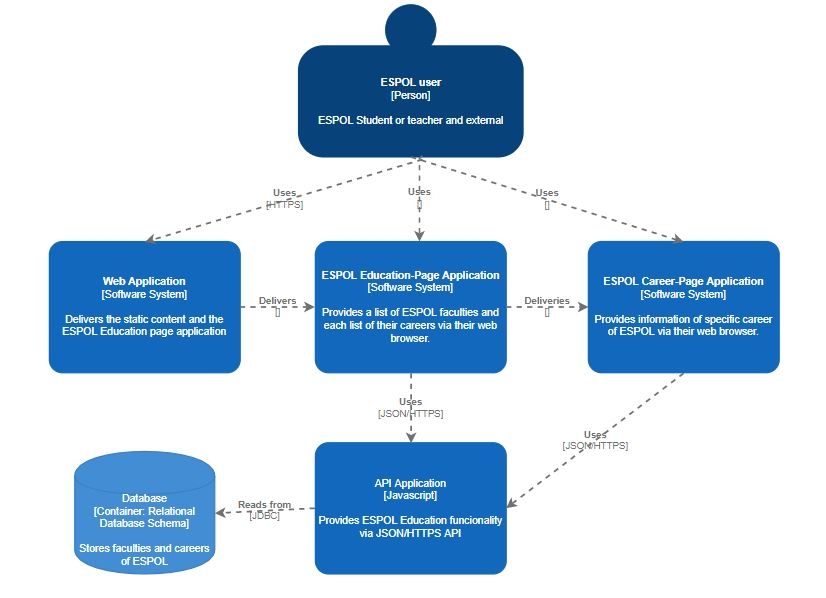
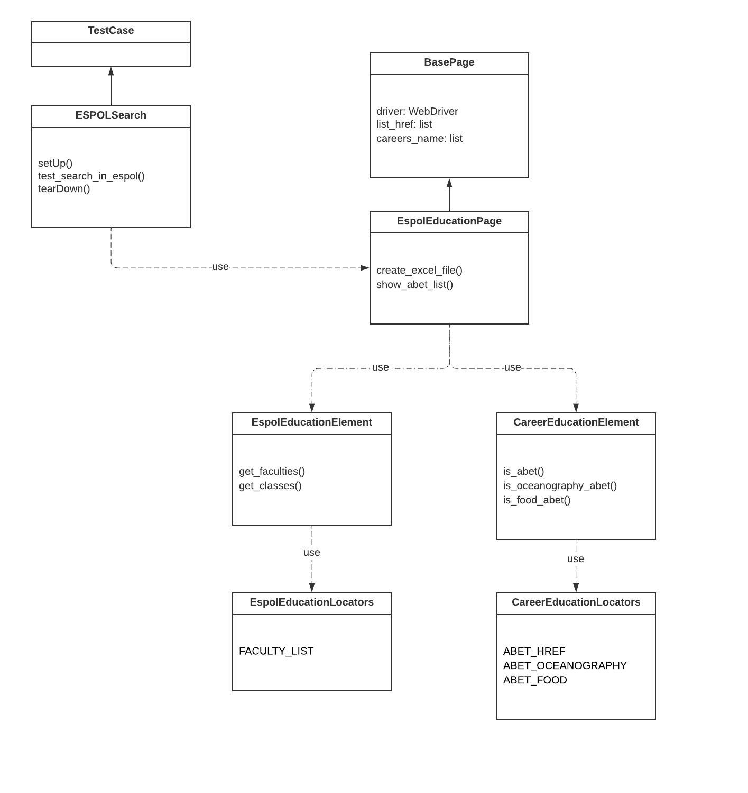
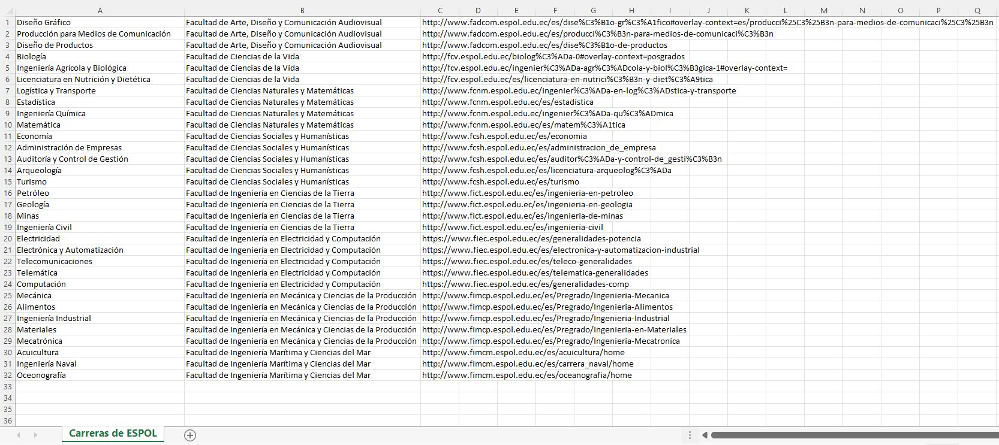
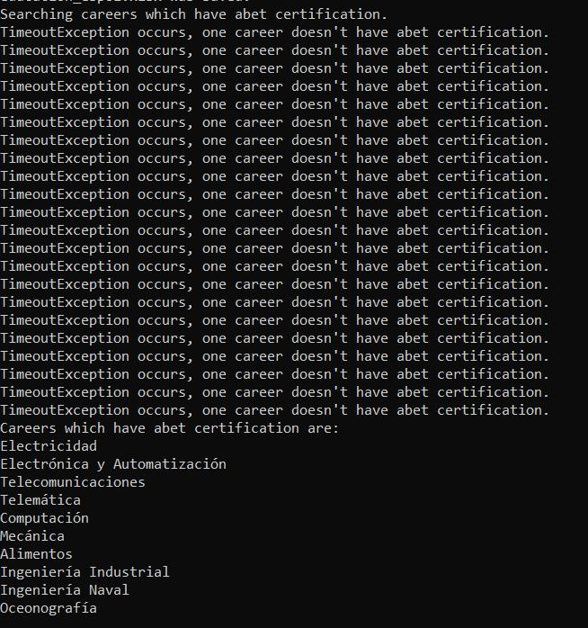

# Selenium Test by Ana Carrión Barbotó

This Python program uses ESPOL Education page as principal and each career page as secondary

Goals:
- Create a driver which simulate that a user get into ESPOL Education web page and read each faculty and their each carrer. 
- Current driver opens each ESPOL carrers web page and validate if it has abet certification.

To achieve these goals I applied the Page Objects design pattern and I got these objects:

1. In main.py there is a class called ESPOLSearch which contains 3 methods:
- setUp() -> Initialize a webdriver of Chrome and open a page of ESPOL Education.
- test_search_in_espol() -> Create a variable called main_page which is an EspolEducationPage instance which receives 3 elements (a driver, a empty list of careers link, a empty list of careers name) that inherits from the father Base Page object, then, it calls 2 methods create_excel_file() and show_abet_list() which doesn't receive any element.
- tearDown () -> Close an instance of webdriver.
2. In page.py there are 3 objects called BasePage and EspolEducationPage.
- Base Page object has 3 attributes mentioned in test_search_in_espol().
- EspolEducationPage object has 4 methods:
  - create_excel_file() -> uses both mentioned methods to go through both html list and create an excel file called educacion_espol.xlsx that follow this format: career_name_es, faculty_name, link_to_career_curriculum and set BasePage values list_href and careers_name which will use in the next method. Resultados:
  
  - show_abet_list() -> return a list which indicates name of careers that has abet certfication using the information obtained from create_excel_file() method. Resultados:
  
3. In locators.py there are all locators to use of each web page. Inspecting ESPOL Education page and Careers page, I have these XPATHs:
- FACULTY_LIST -> both html elements of faculties has div with class="panel-heading" next to h4 with class="panel-title" and next to "a" tag.
- ABET_HREF -> all careers have an element which contains abet url  except 2 careers:
  - OCEANOGRAPHY -> which has an a tag with href="https://amspub.abet.org/aps/category-search?disciplines=57"
  - FOOD -> which has an img tag with src="/sites/fimcp.espol.edu.ec/files/EAC-RGB-W-L.jpg"
4. In element.py there are 2 classes EspolEducationElement and CareerEducationElement, both objects use any locators to get one or mor html objects.

To use:
- open cmd or terminal
- run "python3 main.py"
